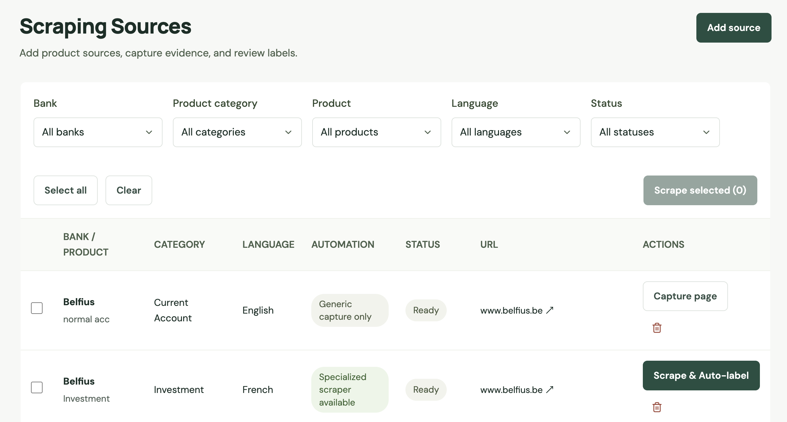
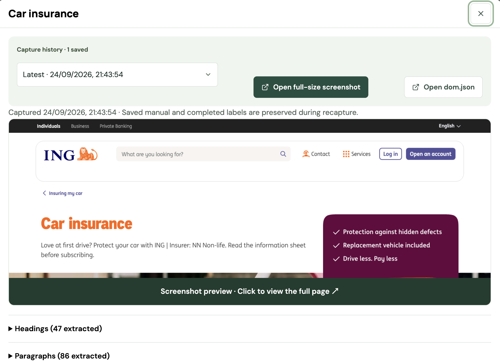
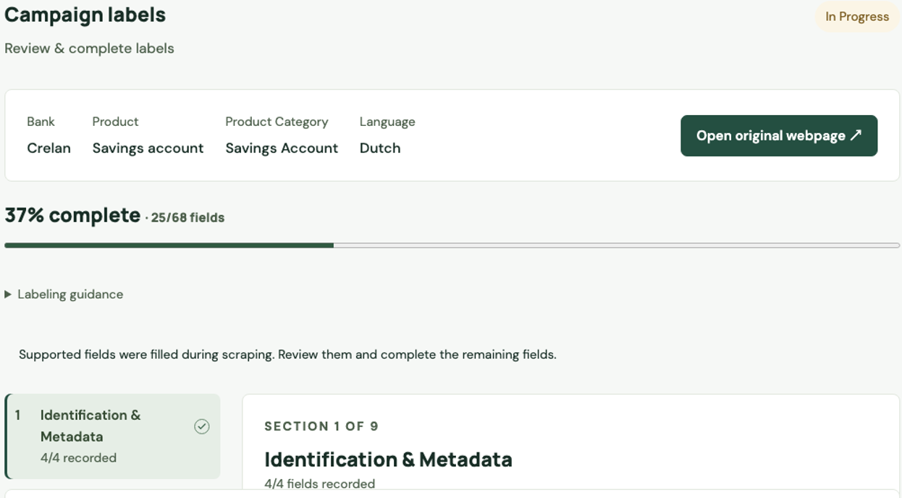
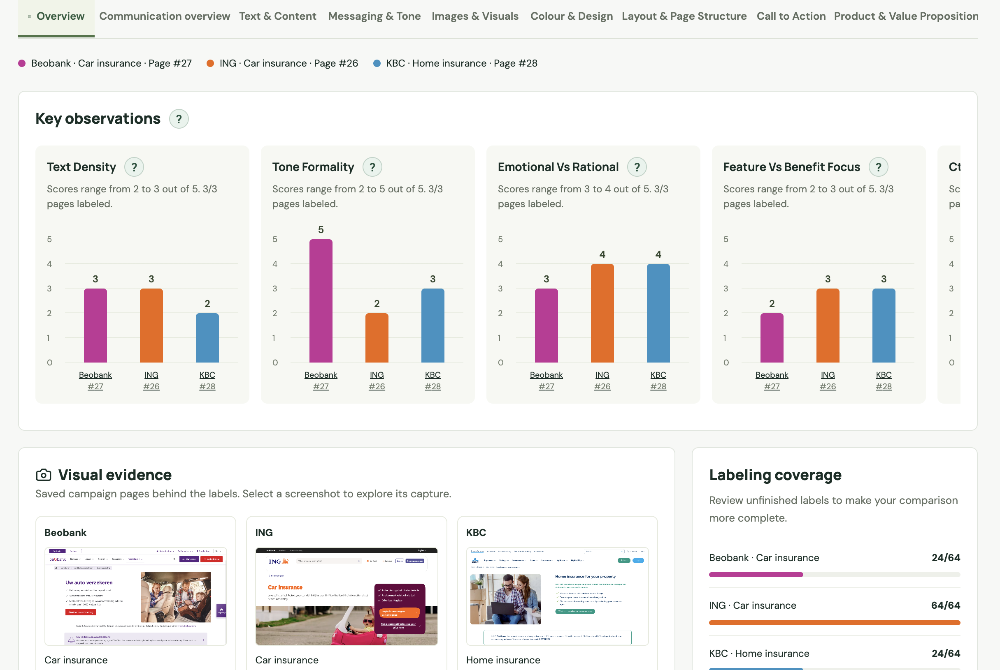
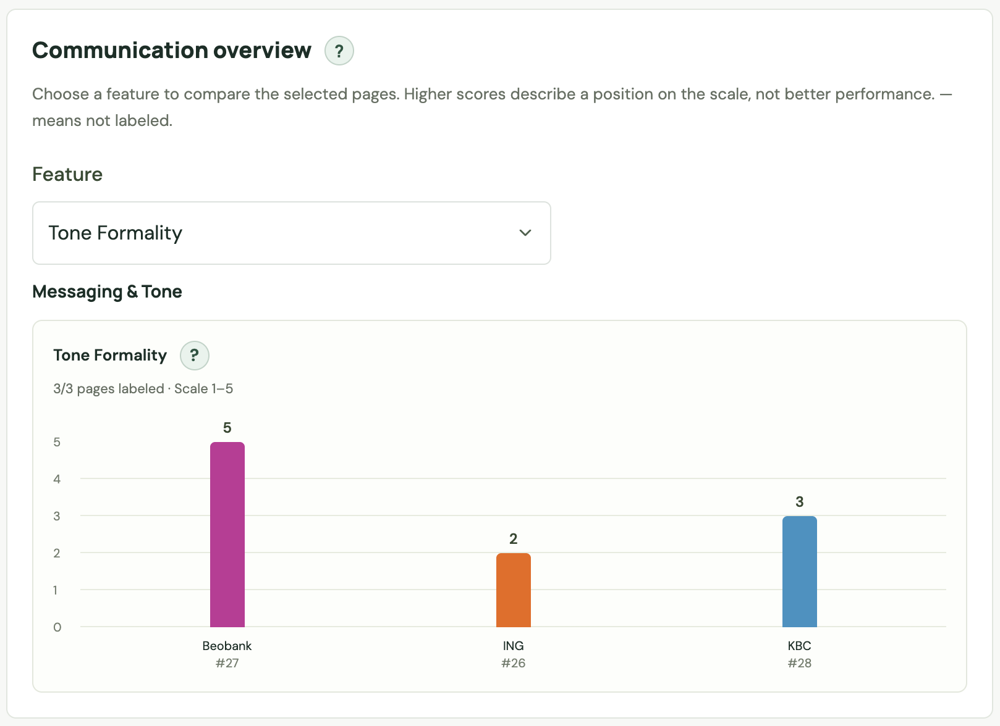

# Banking campaigns comparator

Capture bank product pages, label their communication, and compare similar products.
All application records use one database, configured by `DATABASE_URL`.

## Start here

[App preview](#app-preview) · [Local setup](#local-setup) · [Documentation](docs/README.md)

Use this README to install and run the app. The [documentation index](docs/README.md)
provides reading paths and the complete guide list.

| What you want to do | Where to read |
| --- | --- |
| Install and launch the app | [Local setup](#local-setup), then [application overview](docs/application-overview.md) |
| Collect pages and review labels | [Collection workflow](docs/collection-workflow.md) → [labeling workflow](docs/feature-framework.md) → [field definitions and examples](docs/labeling-field-reference.md) |
| Understand comparison results | [Comparison methodology](docs/comparison.md) |
| Develop or extend the app | [Architecture](docs/architecture.md) → [backend README](backend/README.md) or [frontend README](frontend/README.md) → [development checks](docs/development.md) |
| Add sources or connect automation functions | [Source catalog README](backend/data/sources/README.md) → [scraping pipeline README](backend/app/scraping/README.md) → [collection workflow](docs/collection-workflow.md) |
| Maintain data or integrate with the API | [Database guide](docs/database-guide.md) · [API reference](docs/api-reference.md) |

New to the project? After setup, follow the user reading path in the
[documentation index](docs/README.md#for-users-and-reviewers) before labeling or
interpreting comparisons.

## App preview

**Collect sources → Inspect captures → Review labels → Compare pages.**

These screenshots come from the project presentation and illustrate saved app
states. Labels, counts and layout may differ from your local dataset; comparison
scores are examples of the interface, not validated bank rankings.

### 1. Collect sources

Add product URLs, filter sources, and capture pages. Supported cases also generate
automatic label drafts. [Collection guide](docs/collection-workflow.md).



### 2. Inspect the evidence

Open saved screenshots, capture history and extracted page content before reviewing
labels. [Scraping and capture workflow](backend/app/scraping/README.md).

<details>
<summary>View the capture viewer</summary>



</details>

### 3. Review and complete labels

Check automatic drafts, fill missing fields and track labeling progress across the
shared framework. [Labeling guide](docs/feature-framework.md).



### 4. Compare communication

Compare selected pages through observation charts, saved visual evidence and
labeling coverage. Use the feature tabs to inspect detailed values.
[Comparison guide](docs/comparison.md).



<details>
<summary>View the Communication overview feature chart</summary>

Choose a feature to compare its recorded values across selected pages. Higher
scores indicate a position on the scale, not better performance.



</details>

## Local setup

Requires Docker Desktop, Python 3.11+, and Node.js 22.12+ (22.x).

Start PostgreSQL from the project root:

```bash
docker compose up -d --wait db
```

Install the backend:

```bash
cd backend
python3 -m venv .venv
source .venv/bin/activate
pip install -r requirements.txt
```

For a new installation, copy `.env.example` to `.env`. For an existing installation,
keep `.env` and ensure `DATABASE_URL` points to the database containing your records.
Do not replace it with an empty database.

```bash
python -m playwright install chromium
alembic upgrade head
python -m scripts.seed_catalog
uvicorn app.main:app --reload --host 127.0.0.1 --port 8000
```

In another terminal:

```bash
cd frontend
npm ci
# New installations only: copy .env.example to .env.
npm run dev
```

Open http://localhost:5173. API documentation: http://localhost:8000/docs.

## Workflow

1. **Scraping:** add a source, capture its page, or run supported scraping and labeling.
2. **Dataset:** open a product to inspect capture history and labels.
3. **Labeling:** review automatic drafts, add observations, then complete labeling.
4. **Compare:** select pages in the same product category.

Capture only never creates automatic labels. Recapture preserves manual and completed
labels. Screenshots and DOM files live in `backend/data/captures/`; back up this folder
alongside the database.

## Updating and testing

The migration history has been consolidated into `initial_schema` for a fresh
start. Use an empty database; existing databases on the retired migration chain
must be backed up and replaced with a new database before using this baseline.
See the [database guide](docs/database-guide.md). No reset is performed automatically.

For subsequent updates on this baseline, run `alembic upgrade head` from `backend/`
and restart the backend.

```bash
cd backend
.venv/bin/python -m pytest -q
```

```bash
cd frontend
npm run build
```

For the full verification checklist, see [development checks](docs/development.md).
Return to the [documentation index](docs/README.md) to explore other topics.

## Project timeline — 2 weeks

| Week | Planned work |
| --- | --- |
| Week 1 | Define the scope; build the backend, frontend, scraping and automation functions. |
| Week 2 | Integrate automation, test and improve the app, write documentation and prepare the demo. |

## Contributors

| Contributor | Role | Contributions | Profile |
| --- | --- | --- | --- |
| Liên KIM | Team Lead | Created the web application's backend and frontend; wrote documentation; integrated automation functions into the application. | [LinkedIn](https://www.linkedin.com/in/lienkt0110/) |
| Gaetan | Data Scientist | Contributed to the main scraping pipeline; developed the automatic classifier and automation functions for Images & Visuals; wrote documentation. | [LinkedIn](https://www.linkedin.com/in/ga%C3%ABtan-bricteux/) |
| Hussein | Data Scientist | Contributed to the main scraping pipeline; developed automation functions for Text & Content, Messaging & Tone, and Call to Action. | [LinkedIn](https://www.linkedin.com/in/hussein-abuammar/) |
