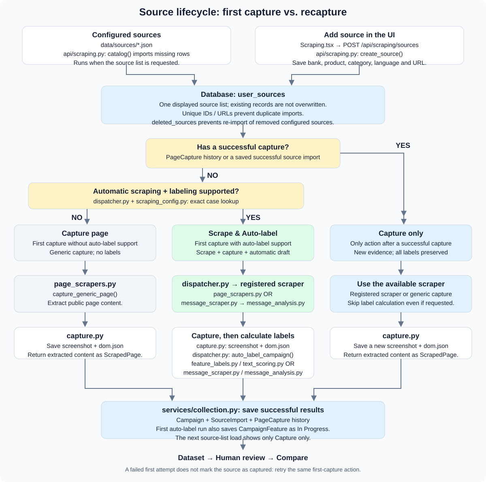

# Scraping flow

Sources live in the database. Each source shows **one capture action**, based on
its successful capture history and automatic support.

[Open the full-size diagram](docs/flow.svg)

## Action rules

| Source state | Button | Result |
| --- | --- | --- |
| No successful capture; auto-label support available | **Scrape & Auto-label** | Scrape, save screenshot/DOM/content, calculate a label draft |
| No successful capture; no auto-label support | **Capture page** | Capture evidence without automatic labels |
| Already captured successfully | **Capture only** | Add new evidence to history; preserve every existing label |

A failed first attempt keeps the first-capture action. A campaign manually added
without capture evidence is still eligible for its first capture. The backend
also enforces capture-only behavior on recapture, even for an auto-label request.

## Files along the flow

| Stage | Files and responsibility |
| --- | --- |
| Source list | `services/source_catalog.py` reads JSON; `api/scraping.py` imports missing sources into `user_sources` on list load and saves UI additions |
| Support | `scraping_config.py` builds `AUTO_SUPPORT`; `dispatcher.py` matches bank/category/product/language |
| Capture | `page_scrapers.py` handles generic/dedicated extraction; `message_scraper.py` connects `message_analysis.py` to app schemas |
| Evidence | `capture.py` saves full-page screenshots and DOM before text cleanup; `public_urls.py` validates generic/message capture targets |
| Labels | `feature_labels.py` and `text_scoring.py` provide measured fields and dedicated text rules; `message_analysis.py` uses `message_analysis_config.py` for message/tone scoring |
| Persistence | `services/collection.py` saves campaign, source import, capture history and optional first-run labels in one transaction |

Paths beginning with `services/` or `api/` are relative to `backend/app/`.

## Source management and storage

- Add a normal source through the UI or `backend/data/sources/*.json`.
- Add message/tone support in `backend/data/sources/messages.json`; dedicated handlers go in `scraping_config.py`.
- JSON import is idempotent: existing rows are retained, and deletion markers prevent re-import.
- Source registration alone does not create a campaign or capture.
- Database: source metadata, campaigns, labels and capture history.
- Files: `backend/data/captures/<artifact_id>/{screenshot.png,dom.json}`; older storage folders remain readable. Back up these with the database.

Message scores require at least 50 words. The adapter reverses feature/benefit
scores (`6 - score`) to match the app scale. Automatic drafts require human review.

Run backend checks: `cd backend && .venv/bin/python -m pytest -q`.
